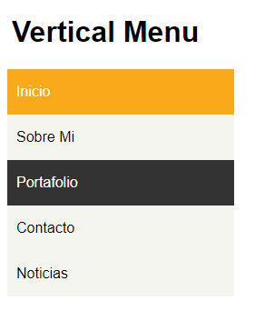

## README
1. Nombre del proyecto:
	- Vertical Menu
2. Descripción del Proyecto:
	- Este proyecto contiene una página web con una demostración de un menú vertical
3. Herramientas utilizadas:
	- HTML5
	- CSS3
4. 
